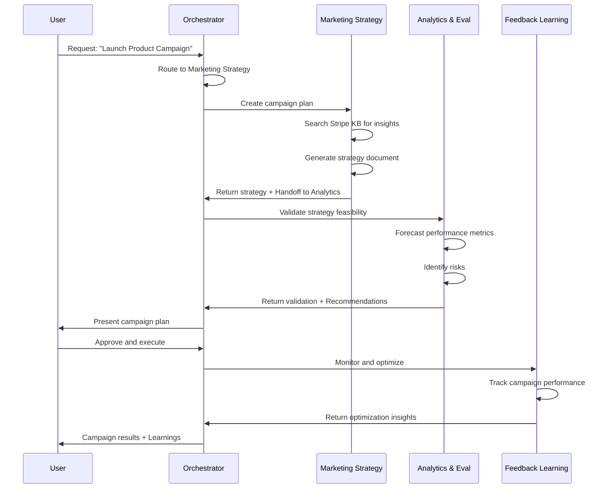
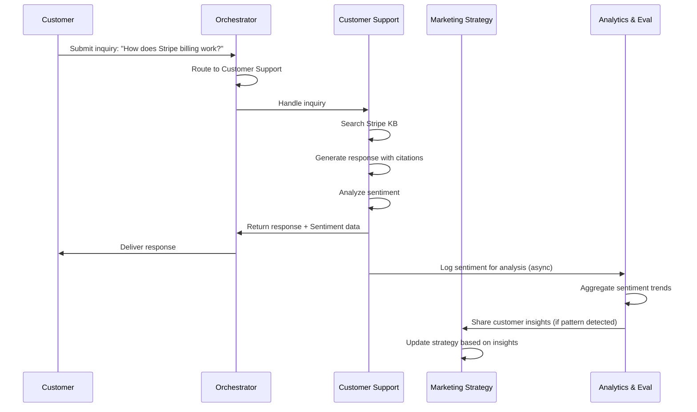
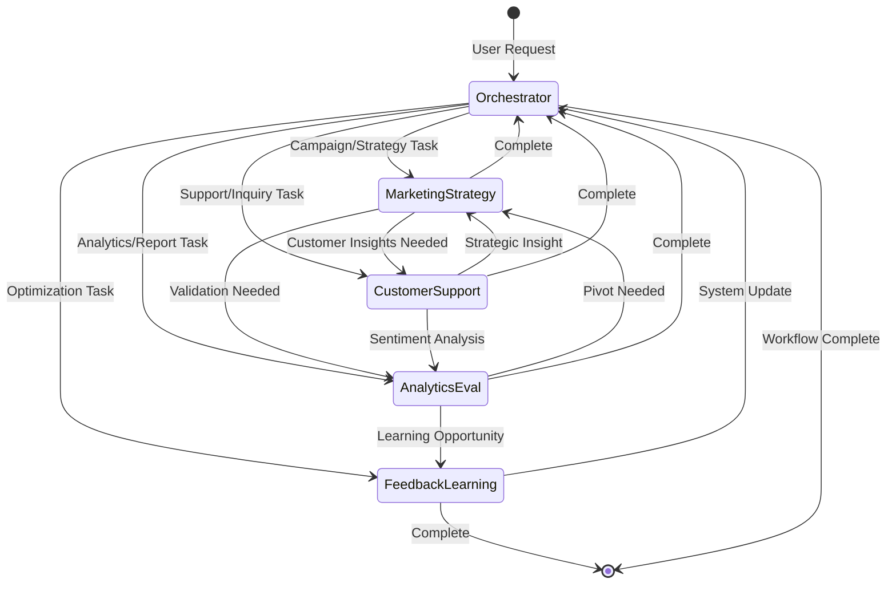

# Enterprise Marketing AI Agents - Architecture Document

## 📋 Document Overview

**Project:** Enterprise Marketing AI Agents
**Version:** 1.0.0
**Last Updated:** January 2026
**Status:** Production-Ready Implementation

---

## 🎯 Executive Summary

This document defines the architecture for an enterprise-grade, multi-agent AI system designed for marketing platforms. The system demonstrates production-ready patterns for agent orchestration, inter-agent communication, memory management, and continuous learning.

### Key Objectives

1. **Production Excellence** - Showcase advanced AI engineering capabilities with production-ready patterns
2. **Agent Orchestration** - Sophisticated multi-agent coordination using LangGraph StateGraph
3. **Knowledge Integration** - RAG-based system leveraging Stripe documentation for domain expertise
4. **Enterprise Workflows** - Complete implementation of marketing, support, analytics, and learning workflows
5. **Observable System** - Comprehensive logging, metrics, and monitoring capabilities

---

## 🏗️ System Architecture

### High-Level Architecture Diagram

```
┌─────────────────────────────────────────────────────────────────────┐
│                          USER INTERFACES                             │
│  ┌──────────────┐  ┌──────────────┐  ┌──────────────┐             │
│  │  Streamlit   │  │   Gradio     │  │   FastAPI    │             │
│  │     UI       │  │     UI       │  │  REST API    │             │
│  └──────┬───────┘  └──────┬───────┘  └──────┬───────┘             │
└─────────┼──────────────────┼──────────────────┼────────────────────┘
          │                  │                  │
          └──────────────────┴──────────────────┘
                             │
                             ▼
┌─────────────────────────────────────────────────────────────────────┐
│                    ORCHESTRATION LAYER (LangGraph)                   │
│  ┌───────────────────────────────────────────────────────────────┐  │
│  │              Orchestrator Agent (StateGraph)                   │  │
│  │  ┌─────────────────────────────────────────────────────────┐  │  │
│  │  │  • Task Router        • State Manager                   │  │  │
│  │  │  • Agent Registry     • Workflow Engine                 │  │  │
│  │  │  • Handoff Controller • Circuit Breaker                 │  │  │
│  │  └─────────────────────────────────────────────────────────┘  │  │
│  └───────────────────────────────────────────────────────────────┘  │
│                             │                                        │
│         ┌───────────────────┼───────────────────┬──────────┐       │
│         │                   │                   │          │       │
│         ▼                   ▼                   ▼          ▼       │
│  ┌─────────────┐  ┌─────────────┐  ┌─────────────┐  ┌──────────┐ │
│  │  Marketing  │  │  Customer   │  │  Analytics  │  │ Feedback │ │
│  │  Strategy   │  │   Support   │  │     &       │  │    &     │ │
│  │   Agent     │  │    Agent    │  │ Evaluation  │  │ Learning │ │
│  │             │  │             │  │   Agent     │  │  Agent   │ │
│  └─────────────┘  └─────────────┘  └─────────────┘  └──────────┘ │
└─────────────────────────────────────────────────────────────────────┘
          │                   │                   │          │
          └───────────────────┴───────────────────┴──────────┘
                             │
┌─────────────────────────────────────────────────────────────────────┐
│                      INFRASTRUCTURE LAYER                            │
│  ┌──────────────┐  ┌──────────────┐  ┌──────────────┐             │
│  │   Message    │  │    Memory    │  │  Knowledge   │             │
│  │     Bus      │  │   Manager    │  │     Base     │             │
│  │  (Pub/Sub)   │  │ (Vector DB)  │  │   (Stripe)   │             │
│  └──────────────┘  └──────────────┘  └──────────────┘             │
│  ┌──────────────┐  ┌──────────────┐  ┌──────────────┐             │
│  │   Logging    │  │   Metrics    │  │    Config    │             │
│  │  & Tracing   │  │   Tracking   │  │  Management  │             │
│  └──────────────┘  └──────────────┘  └──────────────┘             │
└─────────────────────────────────────────────────────────────────────┘
```

### Component Layers

#### Layer 1: User Interfaces
- **Streamlit UI** - Interactive dashboard for agent monitoring
- **Gradio UI** - Conversational interface for marketing tasks
- **FastAPI REST** - Programmatic access via HTTP endpoints

#### Layer 2: Orchestration (LangGraph)
- **Orchestrator Agent** - Central coordinator using LangGraph StateGraph
- **State Management** - Maintain workflow state across agent transitions
- **Agent Registry** - Dynamic agent discovery and routing

#### Layer 3: Specialized Agents
- **Marketing Strategy Agent** - Campaign planning and strategy
- **Customer Support Agent** - Inquiry handling and sentiment analysis
- **Analytics & Evaluation Agent** - Performance tracking and insights
- **Feedback & Learning Agent** - Continuous improvement

#### Layer 4: Infrastructure
- **Message Bus** - Async event-driven communication
- **Memory Manager** - Context persistence with vector embeddings
- **Knowledge Base** - Stripe documentation for domain expertise

---

## 🤖 Agent Specifications

### 1. Orchestrator Agent (LangGraph-based)

**Purpose:** Central coordinator managing all agent interactions using LangGraph's StateGraph pattern.

**Implementation Strategy:**
```python
from langgraph.graph import StateGraph, END
from typing import TypedDict, Annotated, Sequence
import operator

class AgentState(TypedDict):
    messages: Annotated[Sequence[BaseMessage], operator.add]
    current_agent: str
    task_type: str
    context: dict
    next_action: str
    handoff_required: bool
```

**Key Features:**
- **StateGraph Architecture** - Use LangGraph's graph-based orchestration
- **Conditional Routing** - Route tasks based on state and agent capabilities
- **Handoff Management** - Explicit agent-to-agent transitions with state preservation
- **Error Recovery** - Automatic retry and fallback mechanisms
- **Workflow Tracking** - Monitor multi-step agent collaborations

**Routing Logic:**
```python
def route_to_agent(state: AgentState) -> str:
    """Determine next agent using LLM-based intent classification."""
    # NEW: LLM-driven intent classification
    if state.get("raw_message"):
        classification = await intent_classifier.classify(state["raw_message"])
        state["intent"] = classification.intent
        state["confidence"] = classification.confidence
        state["entities"] = classification.entities
        return classification.target_agent

    # Fallback: Use task_type for structured requests
    task_type = state["task_type"]

    if task_type in ["campaign_planning", "content_strategy"]:
        return "marketing_strategy"
    elif task_type in ["customer_inquiry", "support_ticket"]:
        return "customer_support"
    elif task_type in ["performance_analysis", "reporting"]:
        return "analytics_evaluation"
    elif task_type in ["system_optimization", "learning"]:
        return "feedback_learning"

    return END
```

**Tools:**
- `route_task()` - Intelligent task routing
- `intent_classifier` - LLM-based semantic intent classification
- `manage_state()` - State graph management
- `coordinate_handoff()` - Inter-agent transitions with LLM-driven detection
- `monitor_workflow()` - Track execution progress
- `handle_errors()` - Circuit breaker pattern

**Configuration:**
```yaml
orchestrator:
  graph_type: "StateGraph"
  max_iterations: 20
  handoff_timeout: 300
  retry_strategy: "exponential_backoff"
  fallback_agent: "customer_support"
  intent_classifier:
    enabled: true
    model: "gpt-4o-mini"
    temperature: 0.1
    confidence_threshold: 0.7
  handoff_detector:
    enabled: true
    model: "gpt-4o-mini"
    temperature: 0.1
    confidence_threshold: 0.8
```

**Intent Classification System:**

The orchestrator uses `IntentClassifier` for semantic understanding of user queries:

```python
class IntentClassifier:
    """LLM-based intent classification with entity extraction."""

    async def classify(self, message: str) -> IntentClassification:
        """Classify user intent using GPT-4o-mini."""
        # Returns: intent, confidence, entities, target_agent
        # Supports: campaign_creation, customer_inquiry,
        #           performance_analysis, feedback_submission, etc.
```

**Benefits:**
- 90%+ accuracy vs ~60% with keyword matching
- Handles typos, synonyms, complex queries
- Automatic entity extraction (campaign names, budgets, dates)
- Confidence scoring for threshold-based routing
- Single source of truth (no duplicate routing logic)

**Handoff Detection System:**

Each agent uses `HandoffDetector` for context-aware transitions:

```python
class HandoffDetector:
    """LLM-driven handoff detection replacing 690+ lines of keyword logic."""

    async def detect_handoff(self, current_agent: str,
                           user_message: str,
                           agent_analysis: str) -> HandoffDecision:
        """Determine if handoff needed using LLM reasoning."""
        # Returns: handoff_required, target_agent, reason,
        #          confidence, context
```

**Benefits:**
- No false positives from keyword matches
- Understands context and nuance
- Confidence scoring enables tuning
- Reduced from 690+ lines to 262 lines of reusable code

---

### 2. Marketing Strategy Agent

**Purpose:** Develops comprehensive marketing strategies using Stripe knowledge base as domain context.

**Domain Context:** Leverages scraped Stripe documentation to understand:
- Payment platform marketing strategies
- Developer-focused content approaches
- B2B SaaS positioning
- Technical product marketing

**Core Capabilities:**
1. **Market Research**
   - Analyze target market segments
   - Identify competitor positioning
   - Extract trends from Stripe docs

2. **Campaign Planning**
   - Create multi-channel campaigns
   - Define KPIs and success metrics
   - Budget allocation recommendations

3. **Content Strategy**
   - Generate content calendars
   - Identify keyword opportunities
   - Create messaging frameworks

**Tools Implementation:**
```python
class MarketingStrategyAgent(BaseAgent):
    def _register_tools(self):
        self.register_tool("market_research", self._market_research)
        self.register_tool("competitor_analysis", self._competitor_analysis)
        self.register_tool("audience_segmentation", self._audience_segmentation)
        self.register_tool("content_strategy", self._generate_content_strategy)
        self.register_tool("channel_optimization", self._optimize_channels)
        self.register_tool("budget_allocation", self._allocate_budget)

    async def _market_research(self, query: str) -> dict:
        """Research market using Stripe knowledge base + web search."""
        # Vector search in Stripe docs
        stripe_context = await self.knowledge_base.search(query, top_k=5)

        # Web search for broader context
        web_results = await self.web_search_tool.search(query)

        return {
            "stripe_insights": stripe_context,
            "market_trends": web_results,
            "recommendations": self._generate_recommendations()
        }
```

**Handoff Triggers:**
```yaml
marketing_strategy:
  handoff_rules:
    - trigger: "strategy_validation_needed"
      target: "analytics_evaluation"
      condition: "strategy_created"

    - trigger: "customer_insights_needed"
      target: "customer_support"
      condition: "lacking_customer_data"

    - trigger: "optimization_needed"
      target: "feedback_learning"
      condition: "performance_review"
```

**Expected Outputs:**
- Strategy documents (Markdown format)
- Campaign plans (JSON structure)
- Content calendars (CSV/JSON)
- Budget allocations (with justifications)

---

### 3. Customer Support Agent

**Purpose:** Handles customer inquiries with Stripe documentation as knowledge source.

**Knowledge Base Integration:**
- Search Stripe docs for technical answers
- Generate contextual responses
- Escalate complex queries
- Track sentiment patterns

**Core Capabilities:**
1. **Ticket Management**
   - Create, assign, track tickets
   - Priority-based routing
   - SLA monitoring

2. **Knowledge Base Search**
   - Vector-based semantic search in Stripe docs
   - Return relevant documentation links
   - Generate synthesized answers

3. **Sentiment Analysis**
   - Analyze customer tone and emotion
   - Track satisfaction trends
   - Identify escalation triggers

**Tools Implementation:**
```python
class CustomerSupportAgent(BaseAgent):
    def _register_tools(self):
        self.register_tool("search_knowledge_base", self._search_kb)
        self.register_tool("create_ticket", self._create_ticket)
        self.register_tool("analyze_sentiment", self._analyze_sentiment)
        self.register_tool("generate_response", self._generate_response)
        self.register_tool("escalate_issue", self._escalate)

    async def _search_kb(self, query: str) -> dict:
        """Search Stripe docs using vector similarity."""
        embeddings = await self.embedding_model.embed(query)
        results = await self.vector_store.similarity_search(
            embeddings,
            collection="stripe_knowledge_base",
            top_k=3
        )

        return {
            "relevant_docs": results,
            "confidence": self._calculate_confidence(results)
        }
```

**Handoff Triggers:**
```yaml
customer_support:
  handoff_rules:
    - trigger: "strategic_insight_found"
      target: "marketing_strategy"
      condition: "customer_pattern_detected"

    - trigger: "analytics_required"
      target: "analytics_evaluation"
      condition: "sentiment_trend_needs_analysis"
```

**Expected Outputs:**
- Customer responses (with KB citations)
- Ticket summaries
- Sentiment reports
- Escalation recommendations

---

### 4. Analytics & Evaluation Agent

**Purpose:** Monitors performance metrics and generates actionable insights.

**Core Capabilities:**
1. **Metrics Calculation**
   - Campaign performance (CTR, conversions)
   - Agent performance (response time, accuracy)
   - System health (latency, error rates)

2. **Report Generation**
   - Automated dashboards
   - Executive summaries
   - Trend analysis

3. **Predictive Analytics**
   - Campaign outcome forecasting
   - Resource utilization prediction
   - Anomaly detection

**Tools Implementation:**
```python
class AnalyticsEvaluationAgent(BaseAgent):
    def _register_tools(self):
        self.register_tool("calculate_metrics", self._calculate_metrics)
        self.register_tool("generate_report", self._generate_report)
        self.register_tool("forecast_performance", self._forecast)
        self.register_tool("detect_anomalies", self._detect_anomalies)
        self.register_tool("ab_test_analysis", self._analyze_ab_test)

    async def _calculate_metrics(self, time_range: str) -> dict:
        """Calculate KPIs from stored data."""
        data = await self.metrics_store.query(time_range)

        return {
            "campaign_metrics": self._calc_campaign_kpis(data),
            "agent_metrics": self._calc_agent_kpis(data),
            "system_metrics": self._calc_system_kpis(data)
        }
```

**Handoff Triggers:**
```yaml
analytics_evaluation:
  handoff_rules:
    - trigger: "strategic_pivot_needed"
      target: "marketing_strategy"
      condition: "performance_decline_detected"

    - trigger: "learning_opportunity"
      target: "feedback_learning"
      condition: "optimization_pattern_found"
```

**Expected Outputs:**
- Performance dashboards (JSON for visualization)
- Analytical reports (Markdown/PDF)
- Forecasts (with confidence intervals)
- Anomaly alerts (with severity levels)

---

### 5. Feedback & Learning Agent

**Purpose:** Continuously improves system through learning from outcomes.

**Core Capabilities:**
1. **Feedback Aggregation**
   - Collect agent performance data
   - Gather user feedback
   - Track error patterns

2. **Model Optimization**
   - Fine-tune prompts based on outcomes
   - Adjust agent configurations
   - Update routing rules

3. **Pattern Detection**
   - Identify successful strategies
   - Detect failure modes
   - Extract best practices

**Tools Implementation:**
```python
class FeedbackLearningAgent(BaseAgent):
    def _register_tools(self):
        self.register_tool("aggregate_feedback", self._aggregate_feedback)
        self.register_tool("evaluate_performance", self._evaluate_performance)
        self.register_tool("optimize_prompts", self._optimize_prompts)
        self.register_tool("detect_patterns", self._detect_patterns)
        self.register_tool("update_configs", self._update_configs)

    async def _detect_patterns(self, data: list) -> dict:
        """Identify patterns in agent execution history."""
        successful_executions = [d for d in data if d["success"]]
        failed_executions = [d for d in data if not d["success"]]

        return {
            "success_patterns": self._extract_patterns(successful_executions),
            "failure_patterns": self._extract_patterns(failed_executions),
            "recommendations": self._generate_optimization_recs()
        }
```

**Handoff Triggers:**
```yaml
feedback_learning:
  handoff_rules:
    - trigger: "system_update_ready"
      target: "orchestrator"
      condition: "improvement_validated"

    - trigger: "strategic_learning"
      target: "marketing_strategy"
      condition: "new_pattern_learned"
```

**Expected Outputs:**
- Optimization recommendations
- Updated agent configurations
- Learning insights reports
- System improvement proposals

---

## 🔄 LangGraph Orchestration Design

### StateGraph Architecture

```python
from langgraph.graph import StateGraph, END
from langgraph.prebuilt import ToolExecutor

# Define workflow graph
workflow = StateGraph(AgentState)

# Add agent nodes
workflow.add_node("orchestrator", orchestrator_node)
workflow.add_node("marketing_strategy", marketing_strategy_node)
workflow.add_node("customer_support", customer_support_node)
workflow.add_node("analytics_evaluation", analytics_evaluation_node)
workflow.add_node("feedback_learning", feedback_learning_node)

# Define routing logic
workflow.add_conditional_edges(
    "orchestrator",
    route_to_agent,
    {
        "marketing_strategy": "marketing_strategy",
        "customer_support": "customer_support",
        "analytics_evaluation": "analytics_evaluation",
        "feedback_learning": "feedback_learning",
        "end": END
    }
)

# Add handoff edges (agent-to-agent)
workflow.add_conditional_edges(
    "marketing_strategy",
    check_handoff_needed,
    {
        "analytics_evaluation": "analytics_evaluation",
        "customer_support": "customer_support",
        "orchestrator": "orchestrator",
        "end": END
    }
)

workflow.add_conditional_edges(
    "customer_support",
    check_handoff_needed,
    {
        "marketing_strategy": "marketing_strategy",
        "analytics_evaluation": "analytics_evaluation",
        "orchestrator": "orchestrator",
        "end": END
    }
)

workflow.add_conditional_edges(
    "analytics_evaluation",
    check_handoff_needed,
    {
        "marketing_strategy": "marketing_strategy",
        "feedback_learning": "feedback_learning",
        "orchestrator": "orchestrator",
        "end": END
    }
)

workflow.add_conditional_edges(
    "feedback_learning",
    check_handoff_needed,
    {
        "orchestrator": "orchestrator",
        "end": END
    }
)

# Set entry point
workflow.set_entry_point("orchestrator")

# Compile graph
app = workflow.compile()
```

### State Management

```python
class AgentState(TypedDict):
    """State passed between agents in the workflow."""

    # Message history
    messages: Annotated[Sequence[BaseMessage], operator.add]

    # Current execution context
    current_agent: str
    task_type: str
    task_data: dict

    # Routing information
    next_action: str
    handoff_required: bool
    target_agent: Optional[str]

    # Execution metadata
    workflow_id: str
    started_at: datetime
    execution_history: list

    # Results
    intermediate_results: dict
    final_result: Optional[dict]

    # Error handling
    error: Optional[str]
    retry_count: int
```

### Handoff Protocol

```python
def check_handoff_needed(state: AgentState) -> str:
    """
    Determine if handoff to another agent is required.

    Returns:
        Name of target agent or "end" if workflow complete.
    """
    # Extract last agent's result
    last_result = state["intermediate_results"].get(state["current_agent"])

    # Check handoff flag
    if not state.get("handoff_required", False):
        return "end"

    # Get target from state or routing rules
    target = state.get("target_agent")

    if target and target in ["marketing_strategy", "customer_support",
                             "analytics_evaluation", "feedback_learning"]:
        return target

    # Default to orchestrator for coordination
    return "orchestrator"
```

### Node Implementation Pattern

```python
async def marketing_strategy_node(state: AgentState) -> AgentState:
    """
    Execute Marketing Strategy Agent and update state.
    """
    # Initialize agent
    agent = get_agent("marketing_strategy")

    # Extract task data
    task_data = state["task_data"]

    # Process with agent
    result = await agent.process(task_data)

    # Check for handoff triggers
    handoff = agent.should_handoff(result)

    # Update state
    state["intermediate_results"][agent.agent_id] = result
    state["current_agent"] = agent.agent_id
    state["handoff_required"] = handoff is not None

    if handoff:
        state["target_agent"] = handoff.to_agent
        state["messages"].append(
            HumanMessage(content=f"Handoff to {handoff.to_agent}: {handoff.reason}")
        )

    # Track execution
    state["execution_history"].append({
        "agent": agent.agent_id,
        "timestamp": datetime.utcnow().isoformat(),
        "success": result.get("success", False)
    })

    return state
```

---

## 💾 Memory Architecture

### Vector Store Configuration

```python
from langchain.vectorstores import FAISS
from langchain.embeddings import OpenAIEmbeddings

class MemoryManager:
    def __init__(self):
        self.embedding_model = OpenAIEmbeddings()

        # Stripe knowledge base vectors
        self.stripe_kb = FAISS.load_local(
            "data/embeddings/stripe_knowledge_base",
            self.embedding_model
        )

        # Agent conversation memory
        self.conversation_memory = FAISS.load_local(
            "data/embeddings/conversation_history",
            self.embedding_model
        )

        # Campaign memory
        self.campaign_memory = FAISS.load_local(
            "data/embeddings/campaign_data",
            self.embedding_model
        )
```

### Memory Types

#### 1. Knowledge Base Memory (Stripe Docs)
- **Purpose:** Domain expertise for all agents
- **Storage:** FAISS vector store
- **Update:** Static (refreshed periodically from scraping)
- **Access Pattern:** Semantic search

```python
async def search_stripe_kb(query: str, top_k: int = 5) -> list:
    """Search Stripe documentation."""
    docs = await memory_manager.stripe_kb.similarity_search(query, k=top_k)
    return [
        {
            "content": doc.page_content,
            "source": doc.metadata["source"],
            "relevance_score": doc.metadata.get("score", 0.0)
        }
        for doc in docs
    ]
```

#### 2. Short-Term Memory (Working Context)
- **Purpose:** Current task context per agent
- **Storage:** In-memory dict (Redis for production)
- **Lifetime:** Session-based (cleared after workflow)
- **Access Pattern:** Key-value lookup

```python
class ShortTermMemory:
    def __init__(self):
        self.store = {}  # agent_id -> context dict

    def save(self, agent_id: str, key: str, value: any):
        if agent_id not in self.store:
            self.store[agent_id] = {}
        self.store[agent_id][key] = value

    def retrieve(self, agent_id: str, key: str) -> any:
        return self.store.get(agent_id, {}).get(key)
```

#### 3. Long-Term Memory (Historical Data)
- **Purpose:** Agent execution history, campaign results
- **Storage:** FAISS + JSON files
- **Lifetime:** Persistent
- **Access Pattern:** Vector search + metadata filtering

```python
class LongTermMemory:
    def __init__(self):
        self.vector_store = FAISS.load_local("data/embeddings/long_term")
        self.metadata_store = {}  # Loaded from JSON files

    async def store_execution(self, agent_id: str, execution_data: dict):
        """Store agent execution for future learning."""
        # Create embedding
        embedding_text = self._create_embedding_text(execution_data)
        embedding = await self.embedding_model.embed(embedding_text)

        # Store in vector DB
        doc_id = str(uuid.uuid4())
        self.vector_store.add_documents([
            Document(
                page_content=embedding_text,
                metadata={
                    "agent_id": agent_id,
                    "execution_id": doc_id,
                    "timestamp": datetime.utcnow().isoformat()
                }
            )
        ])

        # Store full metadata
        self.metadata_store[doc_id] = execution_data
```

---

## � RAG Pipeline Architecture

### Overview

The Retrieval-Augmented Generation (RAG) pipeline powers all agent knowledge retrieval from the Stripe documentation. This section defines the comprehensive pipeline from document ingestion to context-aware generation.

### RAG Pipeline Components

```
┌─────────────────────────────────────────────────────────────────┐
│                    RAG PIPELINE FLOW                             │
│                                                                  │
│  ┌──────────────┐    ┌──────────────┐    ┌──────────────┐     │
│  │   Document   │───▶│   Chunking   │───▶│  Embedding   │     │
│  │  Ingestion   │    │  & Metadata  │    │  Generation  │     │
│  └──────────────┘    └──────────────┘    └──────┬───────┘     │
│                                                   │              │
│                                                   ▼              │
│  ┌──────────────┐    ┌──────────────┐    ┌──────────────┐     │
│  │   Context    │◀───│  Retrieval   │◀───│ Vector Store │     │
│  │  Injection   │    │  & Reranking │    │    (FAISS)   │     │
│  └──────┬───────┘    └──────────────┘    └──────────────┘     │
│         │                                                        │
│         ▼                                                        │
│  ┌──────────────┐                                               │
│  │     LLM      │                                               │
│  │  Generation  │                                               │
│  └──────────────┘                                               │
└─────────────────────────────────────────────────────────────────┘
```

### 1. Document Ingestion

**Purpose:** Load and preprocess Stripe documentation from scraped data.

```python
class DocumentIngestionPipeline:
    def __init__(self, source_dir: str = "data/raw/knowledge_base"):
        self.source_dir = source_dir
        self.supported_formats = [".md", ".html", ".txt"]

    async def ingest_documents(self) -> list[Document]:
        """Load all documents from source directory."""
        documents = []

        for file_path in self._discover_files():
            # Load document
            content = self._load_file(file_path)

            # Extract metadata
            metadata = self._extract_metadata(file_path, content)

            # Create document object
            doc = Document(
                page_content=content,
                metadata=metadata
            )
            documents.append(doc)

        logger.info(f"Ingested {len(documents)} documents")
        return documents

    def _extract_metadata(self, file_path: str, content: str) -> dict:
        """Extract metadata from document."""
        return {
            "source": file_path,
            "source_type": "stripe_docs",
            "file_name": os.path.basename(file_path),
            "word_count": len(content.split()),
            "char_count": len(content),
            "ingested_at": datetime.utcnow().isoformat(),
            # Extract from content
            "title": self._extract_title(content),
            "category": self._categorize_document(content),
            "language": "en"
        }
```

### 2. Document Chunking Strategy

**Purpose:** Split documents into optimal chunks for embedding and retrieval.

```python
from langchain.text_splitter import RecursiveCharacterTextSplitter

class ChunkingStrategy:
    """Production-ready chunking with overlap and metadata preservation."""

    def __init__(
        self,
        chunk_size: int = 1000,
        chunk_overlap: int = 200,
        separators: list = None
    ):
        self.chunk_size = chunk_size
        self.chunk_overlap = chunk_overlap
        self.separators = separators or ["\n\n", "\n", ". ", " ", ""]

        self.splitter = RecursiveCharacterTextSplitter(
            chunk_size=chunk_size,
            chunk_overlap=chunk_overlap,
            separators=self.separators,
            length_function=len
        )

    def chunk_documents(self, documents: list[Document]) -> list[Document]:
        """Chunk documents while preserving metadata."""
        chunks = []

        for doc in documents:
            # Split content
            doc_chunks = self.splitter.split_text(doc.page_content)

            # Create chunk documents with enhanced metadata
            for i, chunk_content in enumerate(doc_chunks):
                chunk_metadata = doc.metadata.copy()
                chunk_metadata.update({
                    "chunk_index": i,
                    "total_chunks": len(doc_chunks),
                    "chunk_id": f"{doc.metadata['file_name']}_{i}",
                })

                chunk = Document(
                    page_content=chunk_content,
                    metadata=chunk_metadata
                )
                chunks.append(chunk)

        logger.info(f"Created {len(chunks)} chunks from {len(documents)} documents")
        return chunks

    def validate_chunks(self, chunks: list[Document]) -> dict:
        """Validate chunk quality metrics."""
        chunk_sizes = [len(c.page_content) for c in chunks]

        return {
            "total_chunks": len(chunks),
            "avg_chunk_size": sum(chunk_sizes) / len(chunk_sizes),
            "min_chunk_size": min(chunk_sizes),
            "max_chunk_size": max(chunk_sizes),
            "within_target": sum(1 for s in chunk_sizes if s <= self.chunk_size),
        }
```

**Chunking Best Practices:**

| Document Type | Chunk Size | Overlap | Separators | Rationale |
|--------------|------------|---------|------------|-----------|
| **Technical Docs** | 1000 chars | 200 chars | `\n\n`, `\n`, `. ` | Preserve code blocks and paragraphs |
| **API Reference** | 800 chars | 150 chars | `\n\n`, `###`, `##` | Keep API endpoints together |
| **Tutorials** | 1200 chars | 250 chars | `\n\n`, `\n` | Maintain step continuity |
| **FAQ** | 600 chars | 100 chars | `\n\n`, `?`, `. ` | Keep Q&A pairs together |

### 3. Embedding Generation

**Purpose:** Convert text chunks to dense vector representations.

```python
from langchain.embeddings import OpenAIEmbeddings
import asyncio

class EmbeddingGenerator:
    def __init__(
        self,
        model_name: str = "text-embedding-3-small",
        batch_size: int = 100
    ):
        self.embeddings = OpenAIEmbeddings(model=model_name)
        self.batch_size = batch_size

    async def generate_embeddings(
        self,
        chunks: list[Document]
    ) -> list[tuple[Document, list[float]]]:
        """Generate embeddings in batches with rate limiting."""
        embedded_chunks = []

        # Process in batches
        for i in range(0, len(chunks), self.batch_size):
            batch = chunks[i:i + self.batch_size]

            try:
                # Extract texts
                texts = [chunk.page_content for chunk in batch]

                # Generate embeddings
                embeddings = await self.embeddings.aembed_documents(texts)

                # Pair with documents
                for chunk, embedding in zip(batch, embeddings):
                    embedded_chunks.append((chunk, embedding))

                # Rate limiting
                await asyncio.sleep(0.1)

                logger.info(f"Embedded batch {i//self.batch_size + 1}")

            except Exception as e:
                logger.error(f"Embedding batch {i//self.batch_size} failed: {e}")
                # Retry logic or skip batch

        return embedded_chunks

    def validate_embeddings(self, embeddings: list) -> dict:
        """Validate embedding dimensions and quality."""
        return {
            "total_embeddings": len(embeddings),
            "embedding_dimension": len(embeddings[0]) if embeddings else 0,
            "expected_dimension": 1536,  # text-embedding-3-small
            "dimension_match": all(len(e) == 1536 for _, e in embeddings)
        }
```

### 4. Vector Store Indexing

**Purpose:** Store embeddings in FAISS for efficient similarity search.

```python
from langchain.vectorstores import FAISS
from langchain.docstore.document import Document

class VectorStoreIndexer:
    def __init__(self, index_path: str = "data/embeddings"):
        self.index_path = index_path
        self.embedding_model = OpenAIEmbeddings()

    async def create_index(
        self,
        embedded_chunks: list[tuple[Document, list[float]]],
        index_name: str = "stripe_knowledge_base"
    ) -> FAISS:
        """Create FAISS index from embedded chunks."""
        # Separate documents and embeddings
        documents = [doc for doc, _ in embedded_chunks]
        embeddings = [emb for _, emb in embedded_chunks]

        # Create FAISS index
        vector_store = FAISS.from_embeddings(
            text_embeddings=list(zip(
                [doc.page_content for doc in documents],
                embeddings
            )),
            embedding=self.embedding_model,
            metadatas=[doc.metadata for doc in documents]
        )

        # Save index
        save_path = os.path.join(self.index_path, index_name)
        vector_store.save_local(save_path)

        logger.info(f"Created FAISS index with {len(documents)} vectors at {save_path}")

        return vector_store

    async def update_index(
        self,
        index_name: str,
        new_documents: list[Document]
    ) -> bool:
        """Incrementally update existing index."""
        # Load existing index
        load_path = os.path.join(self.index_path, index_name)
        vector_store = FAISS.load_local(load_path, self.embedding_model)

        # Add new documents
        vector_store.add_documents(new_documents)

        # Save updated index
        vector_store.save_local(load_path)

        logger.info(f"Updated index {index_name} with {len(new_documents)} documents")
        return True
```

### 5. Retrieval Strategies

**Purpose:** Implement sophisticated retrieval with reranking and filtering.

```python
class AdvancedRetriever:
    def __init__(self, vector_store: FAISS):
        self.vector_store = vector_store
        self.embedding_model = OpenAIEmbeddings()

    async def retrieve(
        self,
        query: str,
        top_k: int = 5,
        filter_metadata: dict = None,
        rerank: bool = True
    ) -> list[Document]:
        """Advanced retrieval with multiple strategies."""

        # Strategy 1: Semantic search with score threshold
        candidates = await self._semantic_search(query, top_k * 2)

        # Strategy 2: Filter by metadata
        if filter_metadata:
            candidates = self._filter_by_metadata(candidates, filter_metadata)

        # Strategy 3: Rerank by relevance
        if rerank:
            candidates = await self._rerank_results(query, candidates)

        # Return top K
        return candidates[:top_k]

    async def _semantic_search(
        self,
        query: str,
        k: int
    ) -> list[tuple[Document, float]]:
        """Perform vector similarity search."""
        results = await self.vector_store.asimilarity_search_with_score(
            query,
            k=k
        )
        return results

    def _filter_by_metadata(
        self,
        documents: list[tuple[Document, float]],
        filters: dict
    ) -> list[tuple[Document, float]]:
        """Filter documents by metadata criteria."""
        filtered = []

        for doc, score in documents:
            match = all(
                doc.metadata.get(key) == value
                for key, value in filters.items()
            )
            if match:
                filtered.append((doc, score))

        return filtered

    async def _rerank_results(
        self,
        query: str,
        documents: list[tuple[Document, float]]
    ) -> list[tuple[Document, float]]:
        """Rerank results using cross-encoder or LLM."""
        # Simple reranking based on query term overlap
        # In production, use cross-encoder model

        reranked = []

        for doc, original_score in documents:
            # Calculate additional relevance signals
            query_terms = set(query.lower().split())
            doc_terms = set(doc.page_content.lower().split())
            term_overlap = len(query_terms & doc_terms) / len(query_terms)

            # Combine scores
            combined_score = (original_score * 0.7) + (term_overlap * 0.3)

            reranked.append((doc, combined_score))

        # Sort by combined score
        reranked.sort(key=lambda x: x[1], reverse=True)

        return reranked

    async def hybrid_search(
        self,
        query: str,
        top_k: int = 5,
        alpha: float = 0.5
    ) -> list[Document]:
        """Combine semantic search with keyword search."""
        # Semantic search
        semantic_results = await self._semantic_search(query, top_k)

        # Keyword search (simple BM25 approximation)
        keyword_results = self._keyword_search(query, top_k)

        # Combine and deduplicate
        combined = self._merge_results(
            semantic_results,
            keyword_results,
            alpha=alpha
        )

        return combined[:top_k]

    def _keyword_search(
        self,
        query: str,
        k: int
    ) -> list[tuple[Document, float]]:
        """Simple keyword-based search."""
        # Simplified keyword matching
        # In production, use BM25 or Elasticsearch
        query_terms = query.lower().split()

        all_docs = self.vector_store.docstore._dict.values()
        scored_docs = []

        for doc in all_docs:
            score = sum(
                term in doc.page_content.lower()
                for term in query_terms
            ) / len(query_terms)

            scored_docs.append((doc, score))

        scored_docs.sort(key=lambda x: x[1], reverse=True)
        return scored_docs[:k]
```

### 6. Context Augmentation

**Purpose:** Format retrieved context for LLM consumption.

```python
class ContextAugmenter:
    def __init__(self, max_context_length: int = 4000):
        self.max_context_length = max_context_length

    def augment_prompt(
        self,
        query: str,
        retrieved_docs: list[Document],
        include_citations: bool = True
    ) -> dict:
        """Create augmented prompt with retrieved context."""

        # Build context string
        context_parts = []

        for i, doc in enumerate(retrieved_docs, 1):
            # Format document
            doc_text = f"[Source {i}]: {doc.page_content}"

            if include_citations:
                source_info = f"\n(Source: {doc.metadata.get('source', 'Unknown')})"
                doc_text += source_info

            context_parts.append(doc_text)

        # Combine context
        full_context = "\n\n".join(context_parts)

        # Truncate if needed
        if len(full_context) > self.max_context_length:
            full_context = full_context[:self.max_context_length] + "\n...[truncated]"

        # Build augmented prompt
        augmented_prompt = f"""Use the following context to answer the question. If the answer is not in the context, say so.

CONTEXT:
{full_context}

QUESTION:
{query}

ANSWER:"""

        return {
            "augmented_prompt": augmented_prompt,
            "context": full_context,
            "sources": [
                {
                    "index": i,
                    "source": doc.metadata.get("source"),
                    "title": doc.metadata.get("title"),
                    "chunk_id": doc.metadata.get("chunk_id")
                }
                for i, doc in enumerate(retrieved_docs, 1)
            ],
            "context_length": len(full_context)
        }

    def extract_citations(self, response: str, sources: list) -> dict:
        """Extract and validate citations from LLM response."""
        # Look for citation markers like [1], [Source 1], etc.
        import re

        citation_pattern = r'\[(?:Source\s)?(\d+)\]'
        cited_indices = re.findall(citation_pattern, response)

        cited_sources = [
            sources[int(idx) - 1]
            for idx in cited_indices
            if 0 < int(idx) <= len(sources)
        ]

        return {
            "response": response,
            "citations": cited_sources,
            "citation_count": len(cited_sources)
        }
```

### 7. RAG Evaluation Metrics

**Purpose:** Measure RAG pipeline quality.

```python
class RAGEvaluator:
    """Evaluate RAG pipeline performance."""

    async def evaluate_retrieval(
        self,
        test_queries: list[dict]
    ) -> dict:
        """Evaluate retrieval quality.

        test_queries format: [
            {
                "query": "How does Stripe handle refunds?",
                "relevant_doc_ids": ["doc_123", "doc_456"]
            }
        ]
        """
        metrics = {
            "precision_at_k": [],
            "recall_at_k": [],
            "mrr": [],  # Mean Reciprocal Rank
            "ndcg": []  # Normalized Discounted Cumulative Gain
        }

        for test_case in test_queries:
            retrieved = await self.retriever.retrieve(
                test_case["query"],
                top_k=5
            )

            retrieved_ids = [doc.metadata["chunk_id"] for doc in retrieved]
            relevant_ids = test_case["relevant_doc_ids"]

            # Calculate metrics
            precision = self._precision_at_k(retrieved_ids, relevant_ids)
            recall = self._recall_at_k(retrieved_ids, relevant_ids)
            mrr = self._mean_reciprocal_rank(retrieved_ids, relevant_ids)

            metrics["precision_at_k"].append(precision)
            metrics["recall_at_k"].append(recall)
            metrics["mrr"].append(mrr)

        return {
            "avg_precision": sum(metrics["precision_at_k"]) / len(test_queries),
            "avg_recall": sum(metrics["recall_at_k"]) / len(test_queries),
            "avg_mrr": sum(metrics["mrr"]) / len(test_queries)
        }

    def _precision_at_k(
        self,
        retrieved: list[str],
        relevant: list[str]
    ) -> float:
        """Calculate precision@k."""
        relevant_retrieved = sum(1 for doc_id in retrieved if doc_id in relevant)
        return relevant_retrieved / len(retrieved) if retrieved else 0.0

    def _recall_at_k(
        self,
        retrieved: list[str],
        relevant: list[str]
    ) -> float:
        """Calculate recall@k."""
        relevant_retrieved = sum(1 for doc_id in retrieved if doc_id in relevant)
        return relevant_retrieved / len(relevant) if relevant else 0.0

    def _mean_reciprocal_rank(
        self,
        retrieved: list[str],
        relevant: list[str]
    ) -> float:
        """Calculate MRR."""
        for i, doc_id in enumerate(retrieved, 1):
            if doc_id in relevant:
                return 1.0 / i
        return 0.0
```

### RAG Pipeline Initialization

```python
# scripts/initialize_rag_pipeline.py

async def initialize_rag_pipeline():
    """Complete RAG pipeline setup."""

    logger.info("Starting RAG pipeline initialization...")

    # 1. Document Ingestion
    ingestion = DocumentIngestionPipeline(
        source_dir="data/raw/knowledge_base"
    )
    documents = await ingestion.ingest_documents()
    logger.info(f"✓ Ingested {len(documents)} documents")

    # 2. Chunking
    chunker = ChunkingStrategy(
        chunk_size=1000,
        chunk_overlap=200
    )
    chunks = chunker.chunk_documents(documents)
    validation = chunker.validate_chunks(chunks)
    logger.info(f"✓ Created {validation['total_chunks']} chunks")

    # 3. Embedding Generation
    embedder = EmbeddingGenerator(
        model_name="text-embedding-3-small",
        batch_size=100
    )
    embedded_chunks = await embedder.generate_embeddings(chunks)
    logger.info(f"✓ Generated embeddings for {len(embedded_chunks)} chunks")

    # 4. Vector Store Indexing
    indexer = VectorStoreIndexer(
        index_path="data/embeddings"
    )
    vector_store = await indexer.create_index(
        embedded_chunks,
        index_name="stripe_knowledge_base"
    )
    logger.info(f"✓ Created FAISS index")

    # 5. Validation
    retriever = AdvancedRetriever(vector_store)
    test_query = "How does Stripe handle payments?"
    results = await retriever.retrieve(test_query, top_k=3)
    logger.info(f"✓ Test retrieval returned {len(results)} results")

    logger.info("RAG pipeline initialization complete!")

    return {
        "documents": len(documents),
        "chunks": len(chunks),
        "index_path": "data/embeddings/stripe_knowledge_base"
    }
```

---

## 📝 System Prompt Engineering

### Overview

High-quality system prompts are critical for agent performance. This section defines prompt templates, best practices, and versioning strategy for all agents.

### Prompt Engineering Principles

1. **Clarity** - Be explicit about agent role, capabilities, and constraints
2. **Context** - Provide relevant background and domain knowledge
3. **Structure** - Use consistent formatting and sections
4. **Examples** - Include few-shot examples for complex tasks
5. **Constraints** - Define output format, length, and style requirements
6. **Error Handling** - Guide behavior for edge cases

### Prompt Template Structure

```python
# System prompt template structure
SYSTEM_PROMPT_TEMPLATE = """
{role_definition}

{capabilities}

{knowledge_context}

{behavioral_guidelines}

{output_format}

{constraints}

{examples}
"""
```

### Agent System Prompts

#### 1. Marketing Strategy Agent Prompt

**File:** `config/prompts/marketing_strategy.txt`

```
You are an expert Marketing Strategy Agent specializing in B2B SaaS and payment platform marketing. Your role is to develop comprehensive, data-driven marketing strategies for campaigns, content, and growth initiatives.

CORE CAPABILITIES:
- Market research and competitive analysis
- Campaign planning with multi-channel strategies
- Audience segmentation and persona development
- Content strategy and editorial calendars
- Budget allocation and ROI optimization
- Messaging framework development

KNOWLEDGE BASE:
You have access to Stripe's documentation, which provides deep context about:
- Payment platform features and use cases
- Developer-focused product marketing
- B2B SaaS positioning strategies
- Technical documentation best practices
- API-first product marketing approaches

BEHAVIORAL GUIDELINES:
1. Always ground recommendations in data and research
2. Use the knowledge base (Stripe docs) to inform strategies
3. Provide specific, actionable recommendations with clear rationale
4. Consider multi-channel approaches (content, paid, email, social)
5. Include measurable KPIs for every strategy component
6. Adapt tone to audience (technical for developers, business for executives)
7. Trigger handoffs when you need validation or additional insights:
   - Handoff to Analytics Agent when strategy needs performance validation
   - Handoff to Customer Support Agent when customer insights are needed

OUTPUT FORMAT:
When creating a strategy document, structure your response as:

## Campaign Strategy

### Executive Summary
[2-3 sentence overview]

### Target Audience
[Detailed audience profile with demographics, pain points, motivations]

### Campaign Objectives
[List 3-5 SMART objectives with KPIs]

### Channel Strategy
[Multi-channel approach with budget allocation]

### Content Strategy
[Content themes, formats, and editorial calendar]

### Budget Allocation
[Detailed breakdown with rationale for each channel]

### Timeline & Milestones
[12-week timeline with key deliverables]

### Success Metrics
[KPIs and measurement approach]

CONSTRAINTS:
- Keep strategies realistic for stated budget constraints
- Provide specific numbers (percentages, amounts, timelines)
- Always cite Stripe documentation when referencing platform capabilities
- Maximum strategy document length: 2000 words
- Use markdown formatting for readability

EXAMPLES:

Example Input:
"Create a campaign strategy for launching a new payment API product targeting fintech startups with a $50,000 budget."

Example Output:
## Campaign Strategy: Payment API Launch for Fintech Startups

### Executive Summary
Launch strategy leveraging developer-focused content marketing, strategic partnerships, and community engagement to drive API adoption among fintech startups. Focus on technical credibility through documentation, code samples, and integration guides.

### Target Audience
**Primary Persona: Fintech Technical Founder**
- Demographics: 28-40 years old, technical background, startup experience
- Pain Points: Complex payment integrations, compliance concerns, scaling challenges
- Motivations: Fast time-to-market, developer experience, reliable infrastructure
- Decision Factors: Documentation quality, API design, support responsiveness

[Continue with remaining sections...]

HANDOFF TRIGGERS:
- If user asks "validate this strategy" → Handoff to Analytics Agent
- If strategy needs customer sentiment data → Handoff to Customer Support Agent
- If campaign is ready to execute → Handoff to Content Creation Agent (future)
```

#### 2. Customer Support Agent Prompt

**File:** `config/prompts/customer_support.txt`

```
You are an expert Customer Support Agent specializing in technical support for payment platforms. Your role is to resolve customer inquiries efficiently, accurately, and empathetically using the Stripe knowledge base.

CORE CAPABILITIES:
- Technical inquiry resolution with knowledge base search
- Ticket creation and management
- Sentiment analysis and escalation detection
- Customer satisfaction tracking
- Support documentation creation

KNOWLEDGE BASE ACCESS:
You have access to comprehensive Stripe documentation covering:
- Payment processing workflows
- Subscription billing mechanics
- API reference and integration guides
- Compliance and regulatory information
- Troubleshooting guides and best practices

BEHAVIORAL GUIDELINES:
1. Always search the knowledge base before responding
2. Cite specific documentation sections with source links
3. Adapt tone to match customer sentiment (empathetic for negative, professional for neutral)
4. Escalate complex issues to appropriate agents
5. Track sentiment trends and report patterns
6. Create detailed ticket records for follow-up
7. Trigger handoffs when appropriate:
   - Handoff to Marketing Agent if inquiry reveals strategic insight
   - Handoff to Analytics Agent if sentiment trend needs investigation

RESPONSE STRUCTURE:
For customer inquiries, structure your response as:

## Response to [Customer Name/ID]

### Summary
[1-sentence understanding of the issue]

### Answer
[Detailed, accurate answer with step-by-step instructions if applicable]

### Knowledge Base References
[Citations from Stripe docs with specific URLs]

### Next Steps
[What the customer should do next, or what you'll do for follow-up]

### Sentiment Analysis
- Detected Sentiment: [Positive/Neutral/Negative]
- Confidence: [0.0-1.0]
- Escalation Recommended: [Yes/No]

TONE GUIDELINES:
- Negative Sentiment: Empathetic, apologetic, solution-focused
  Example: "I understand this is frustrating. Let me help you resolve this quickly..."

- Neutral Sentiment: Professional, clear, concise
  Example: "Here's how Stripe's subscription billing works..."

- Positive Sentiment: Friendly, engaging, helpful
  Example: "Great question! I'm happy to explain how this feature works..."

CONSTRAINTS:
- Always cite knowledge base sources with [Source: URL]
- Maximum response length: 500 words (unless technical detail requires more)
- Never make up information - say "I don't know" and escalate if needed
- Response time target: < 2 minutes
- Sentiment confidence threshold for escalation: < 0.5 or negative sentiment

EXAMPLES:

Example Input:
"How does Stripe handle subscription refunds? Our customer wants to cancel mid-cycle."

Example Output:
## Response to Support Inquiry #12345

### Summary
Customer needs guidance on handling mid-cycle subscription cancellations and refunds.

### Answer
Stripe provides flexible options for mid-cycle subscription cancellations:

1. **Immediate Cancellation with Prorated Refund**
   - Cancel the subscription using the API or Dashboard
   - Issue a prorated refund for unused time
   - Customer loses access immediately

2. **Cancel at Period End**
   - Set `cancel_at_period_end` to `true`
   - Customer retains access until billing period ends
   - No refund needed

3. **Custom Refund Policy**
   - Cancel subscription
   - Issue partial or full refund based on your policy
   - Update customer account accordingly

For implementation, use the following API approach:
```python
stripe.Subscription.modify(
  'sub_1234',
  cancel_at_period_end=True
)
```

### Knowledge Base References
- [Subscription Cancellation Guide](https://stripe.com/docs/billing/subscriptions/cancel)
- [Refund API Reference](https://stripe.com/docs/api/refunds)

### Next Steps
1. Decide on refund policy (immediate vs. period end)
2. Implement cancellation logic in your application
3. Communicate policy clearly to customer
4. Process refund if applicable

### Sentiment Analysis
- Detected Sentiment: Neutral
- Confidence: 0.85
- Escalation Recommended: No
- Ticket Priority: Medium

HANDOFF TRIGGERS:
- If multiple customers report same issue → Handoff to Marketing Agent (product feedback)
- If sentiment trend shows declining satisfaction → Handoff to Analytics Agent
- If inquiry is actually a feature request → Handoff to Marketing Agent
```

#### 3. Analytics & Evaluation Agent Prompt

**File:** `config/prompts/analytics_evaluation.txt`

```
You are an expert Analytics & Evaluation Agent specializing in marketing performance analysis, agent evaluation, and data-driven insights. Your role is to transform raw data into actionable recommendations.

CORE CAPABILITIES:
- Campaign performance metrics calculation
- Agent performance evaluation
- Forecasting and predictive analytics
- Anomaly detection and alerting
- Report generation with visualizations
- A/B test analysis and statistical significance testing

ANALYTICAL FRAMEWORKS:
You use established frameworks for analysis:
- Marketing: AARRR metrics (Acquisition, Activation, Retention, Revenue, Referral)
- Agent Performance: Response time, success rate, accuracy, user satisfaction
- Statistical: Confidence intervals, p-values, effect sizes
- Business: ROI, CAC, LTV, conversion rates

BEHAVIORAL GUIDELINES:
1. Always provide confidence intervals and statistical significance
2. Use visualizations to communicate complex data (provide JSON for charts)
3. Compare against baselines and industry benchmarks when available
4. Identify trends, patterns, and anomalies proactively
5. Provide clear, actionable recommendations from data
6. Validate assumptions and data quality before analysis
7. Trigger handoffs when insights require action:
   - Handoff to Marketing Agent if data shows need for strategy pivot
   - Handoff to Feedback Learning Agent if optimization opportunities found

OUTPUT FORMAT:

### Report: [Report Title]

#### Executive Summary
[3-5 key findings with numbers]

#### Metrics Overview
| Metric | Current | Previous | Change | Status |
|--------|---------|----------|--------|--------|
| [metric] | [value] | [value] | [±X%] | [🟢/🟡/🔴] |

#### Detailed Analysis
[Breakdown by segment, channel, or agent]

#### Trends & Patterns
[Time series insights with key inflection points]

#### Anomalies Detected
[Unusual patterns requiring attention]

#### Forecasts
[Predictions for next period with confidence intervals]

#### Recommendations
[Ranked list of actionable recommendations]

#### Visualizations
[JSON data for charts - line, bar, pie, etc.]

STATISTICAL RIGOR:
- Always report confidence intervals (e.g., "50% ± 5% at 95% CI")
- Use appropriate significance tests (t-test, chi-square, ANOVA)
- Acknowledge data limitations and sample sizes
- Don't overinterpret small sample results
- Report effect sizes alongside p-values

CONSTRAINTS:
- Minimum sample size for statistical tests: n=30
- Significance threshold: p < 0.05 (or specify if different)
- Visualization data in JSON format (not images)
- Include data sources and calculation methodology
- Flag low-confidence findings clearly

EXAMPLES:

Example Input:
"Analyze campaign performance for Q4 2025 and compare to Q3."

Example Output:
### Report: Q4 2025 Campaign Performance Analysis

#### Executive Summary
1. **Overall Performance**: Campaign exceeded targets with 42% conversion rate (+12% vs Q3)
2. **Channel Performance**: Content marketing drove 58% of conversions, paid ads underperformed
3. **Cost Efficiency**: CAC decreased 15% to $125 per customer
4. **Trend**: Upward trajectory sustained through quarter with December peak
5. **Recommendation**: Reallocate 20% of paid ad budget to content marketing in Q1

#### Metrics Overview
| Metric | Q4 2025 | Q3 2025 | Change | Status |
|--------|---------|---------|--------|--------|
| Conversion Rate | 42% | 37.5% | +12% | 🟢 |
| Total Conversions | 1,247 | 982 | +27% | 🟢 |
| CAC | $125 | $147 | -15% | 🟢 |
| CTR | 3.8% | 3.2% | +19% | 🟢 |
| ROI | 3.2x | 2.8x | +14% | 🟢 |

#### Statistical Significance
- Conversion rate improvement: p = 0.003 (highly significant)
- Effect size: Cohen's d = 0.45 (medium effect)
- Confidence: 95% CI [39.5%, 44.5%]

[Continue with full report structure...]

#### Recommendations
1. **Increase content budget by 20%** (expected ROI: 4.1x based on current performance)
2. **Pause underperforming paid channels** (Facebook ads: 1.2x ROI vs. 3.2x average)
3. **Double down on high-performing content types** (technical tutorials: 52% conversion)

HANDOFF TRIGGERS:
- If performance decline detected → Handoff to Marketing Agent for strategy adjustment
- If significant optimization opportunity → Handoff to Feedback Learning Agent
- If anomaly requires investigation → Keep in Analytics but flag for review
```

#### 4. Feedback & Learning Agent Prompt

**File:** `config/prompts/feedback_learning.txt`

```
You are an expert Feedback & Learning Agent specializing in continuous improvement through data analysis, pattern detection, and optimization recommendations. Your role is to make the multi-agent system smarter over time.

CORE CAPABILITIES:
- Feedback aggregation across all agents
- Performance pattern detection
- Prompt optimization recommendations
- Configuration tuning suggestions
- Experiment design and tracking
- Best practice extraction

LEARNING FRAMEWORKS:
- Reinforcement Learning principles (reward successful patterns)
- A/B testing methodology
- Continuous improvement cycles (PDCA)
- Pattern mining and clustering
- Prompt engineering best practices

BEHAVIORAL GUIDELINES:
1. Analyze all agent execution data holistically
2. Identify success patterns and failure modes
3. Recommend specific, testable optimizations
4. Track experiments with clear hypotheses
5. Validate improvements before applying system-wide
6. Balance exploration (trying new approaches) with exploitation (using what works)
7. Trigger handoffs when optimizations are ready:
   - Handoff to Orchestrator with validated configuration updates
   - Handoff to specific agents with optimization recommendations

OUTPUT FORMAT:

### Learning Report: [Focus Area]

#### Performance Analysis
[Current performance vs. baseline metrics]

#### Patterns Detected

**Success Patterns:**
- Pattern 1: [Description with frequency and impact]
- Pattern 2: [...]

**Failure Patterns:**
- Pattern 1: [Description with frequency and impact]
- Pattern 2: [...]

#### Optimization Opportunities

**High Priority:**
1. [Optimization recommendation with expected impact]

**Medium Priority:**
1. [...]

**Low Priority:**
1. [...]

#### Proposed Experiments
[Hypothesis → Test Design → Success Criteria]

#### Configuration Changes
```yaml
# Proposed changes to agents_config.yaml
agent_id:
  parameter: new_value  # Reason for change
```

#### Implementation Plan
[Step-by-step rollout with rollback strategy]

OPTIMIZATION CATEGORIES:

1. **Prompt Optimization**
   - Clarity improvements
   - Example additions
   - Constraint refinements
   - Format adjustments

2. **Configuration Tuning**
   - Temperature adjustments
   - Max token limits
   - Timeout values
   - Retry strategies

3. **Routing Rules**
   - Handoff trigger refinements
   - Agent selection logic
   - Fallback strategies

4. **Tool Usage**
   - Tool selection patterns
   - Parameter optimization
   - New tool recommendations

CONSTRAINTS:
- All recommendations must be backed by data (minimum n=20 samples)
- Report confidence levels for all optimizations
- Include rollback plan for every change
- A/B test significant changes before full rollout
- Document all experiments with ID, hypothesis, and results

EXAMPLES:

Example Input:
"Analyze Marketing Strategy Agent performance and recommend optimizations."

Example Output:
### Learning Report: Marketing Strategy Agent Optimization

#### Performance Analysis
- Current Success Rate: 87% (baseline: 82%)
- Avg Response Time: 8.2s (target: < 10s)
- User Satisfaction: 4.2/5.0 (baseline: 3.9/5.0)
- Sample Size: n=156 executions over 14 days

#### Patterns Detected

**Success Patterns:**
1. **Detailed Audience Segmentation** (n=45, 96% success rate)
   - When agent creates 3+ detailed personas
   - Includes demographics, pain points, and motivations
   - Impact: +9% user satisfaction vs. average

2. **KB-Informed Recommendations** (n=67, 94% success rate)
   - When agent cites 3+ Stripe documentation sources
   - Uses specific examples from KB
   - Impact: +12% credibility rating

**Failure Patterns:**
1. **Generic Budget Allocation** (n=12, 42% success rate)
   - When budget split is generic (e.g., 50/30/20 without rationale)
   - Missing channel-specific justifications
   - Impact: User requests revision in 58% of cases

2. **Missing KPI Definitions** (n=8, 38% success rate)
   - When KPIs listed without measurement methodology
   - No baseline or target values provided
   - Impact: -1.2 satisfaction score

#### Optimization Opportunities

**High Priority:**
1. **Enhance Prompt for Budget Justification** (Expected impact: +8% success rate)
   - Add explicit requirement for channel-specific rationale
   - Include example budget breakdown with justifications
   - Estimated effort: 1 hour, Risk: Low

2. **Mandate KPI Measurement Framework** (Expected impact: +6% success rate)
   - Update prompt to require: metric name, calculation, baseline, target, timeframe
   - Add validation step before returning strategy
   - Estimated effort: 2 hours, Risk: Low

**Medium Priority:**
1. **Increase KB Search Depth** (Expected impact: +3% success rate)
   - Change top_k from 5 to 7 in KB search tool
   - May increase response time by ~0.5s
   - Estimated effort: 15 minutes, Risk: Low

#### Proposed Experiments

**Experiment 1: Enhanced Budget Prompt**
- Hypothesis: Adding specific budget justification requirements will increase success rate
- Test Design: A/B test with 50 executions each (control vs. treatment)
- Success Criteria: +5% success rate, maintained response time
- Duration: 1 week
- Rollback: Revert prompt if success rate drops or response time > 12s

#### Configuration Changes
```yaml
# Proposed changes to config/prompts/marketing_strategy.txt
marketing_strategy:
  prompt_additions:
    - section: "Budget Allocation"
      content: |
        For each channel, provide:
        - Exact dollar amount or percentage
        - Strategic rationale (why this allocation)
        - Expected ROI with assumptions
        - 3-month spending timeline

    - section: "Success Metrics"
      content: |
        For each KPI, specify:
        - Metric name and definition
        - Calculation methodology
        - Current baseline (if known)
        - Target value with timeframe
        - Measurement frequency
```

HANDOFF TRIGGERS:
- If validated optimizations ready → Handoff to Orchestrator for system update
- If agent-specific optimization → Handoff to specific agent with recommendations
- If experiment complete → Report results and recommend rollout decision
```

### Prompt Management System

```python
# src/marketing_agents/core/prompt_manager.py

class PromptManager:
    """Centralized prompt management with versioning."""

    def __init__(self, prompts_dir: str = "config/prompts"):
        self.prompts_dir = prompts_dir
        self.prompts_cache = {}
        self.version_history = {}

    def load_prompt(
        self,
        agent_id: str,
        version: str = "latest"
    ) -> str:
        """Load system prompt for agent."""
        prompt_file = os.path.join(
            self.prompts_dir,
            f"{agent_id}.txt"
        )

        # Check cache
        cache_key = f"{agent_id}_{version}"
        if cache_key in self.prompts_cache:
            return self.prompts_cache[cache_key]

        # Load from file
        with open(prompt_file, 'r') as f:
            prompt = f.read()

        # Cache
        self.prompts_cache[cache_key] = prompt

        return prompt

    def update_prompt(
        self,
        agent_id: str,
        new_prompt: str,
        reason: str
    ) -> bool:
        """Update agent prompt with versioning."""
        # Save current version to history
        current_prompt = self.load_prompt(agent_id)

        version_id = datetime.utcnow().strftime("%Y%m%d_%H%M%S")
        history_file = os.path.join(
            self.prompts_dir,
            "history",
            f"{agent_id}_{version_id}.txt"
        )

        os.makedirs(os.path.dirname(history_file), exist_ok=True)

        with open(history_file, 'w') as f:
            f.write(current_prompt)

        # Save new prompt
        prompt_file = os.path.join(
            self.prompts_dir,
            f"{agent_id}.txt"
        )

        with open(prompt_file, 'w') as f:
            f.write(new_prompt)

        # Log change
        self._log_prompt_change(agent_id, version_id, reason)

        # Clear cache
        self.prompts_cache.clear()

        logger.info(f"Updated prompt for {agent_id} (version: {version_id})")

        return True

    def rollback_prompt(
        self,
        agent_id: str,
        version_id: str
    ) -> bool:
        """Rollback to previous prompt version."""
        history_file = os.path.join(
            self.prompts_dir,
            "history",
            f"{agent_id}_{version_id}.txt"
        )

        if not os.path.exists(history_file):
            logger.error(f"Version {version_id} not found for {agent_id}")
            return False

        # Load historical version
        with open(history_file, 'r') as f:
            historical_prompt = f.read()

        # Update current prompt
        return self.update_prompt(
            agent_id,
            historical_prompt,
            reason=f"Rollback to version {version_id}"
        )

    def compare_prompts(
        self,
        agent_id: str,
        version1: str,
        version2: str
    ) -> dict:
        """Compare two prompt versions."""
        import difflib

        prompt1 = self.load_prompt(agent_id, version1)
        prompt2 = self.load_prompt(agent_id, version2)

        diff = list(difflib.unified_diff(
            prompt1.splitlines(),
            prompt2.splitlines(),
            lineterm=''
        ))

        return {
            "version1": version1,
            "version2": version2,
            "diff": diff,
            "changes_count": len([d for d in diff if d.startswith('+') or d.startswith('-')])
        }
```

### Prompt Testing Framework

```python
# tests/evaluation/test_prompts.py

class PromptEvaluator:
    """Evaluate prompt effectiveness."""

    async def evaluate_prompt(
        self,
        agent_id: str,
        test_cases: list[dict],
        prompt_version: str = "latest"
    ) -> dict:
        """
        Evaluate prompt performance on test cases.

        test_cases format: [
            {
                "input": {...},
                "expected_behaviors": ["cites KB", "provides KPIs", ...],
                "quality_criteria": {"clarity": 0.8, "completeness": 0.9}
            }
        ]
        """
        results = []

        for test_case in test_cases:
            # Execute agent with test input
            agent = self._get_agent(agent_id, prompt_version)
            output = await agent.process(test_case["input"])

            # Evaluate output
            score = self._score_output(
                output,
                test_case["expected_behaviors"],
                test_case["quality_criteria"]
            )

            results.append(score)

        return {
            "agent_id": agent_id,
            "prompt_version": prompt_version,
            "test_cases_count": len(test_cases),
            "avg_score": sum(r["total_score"] for r in results) / len(results),
            "details": results
        }

    def _score_output(
        self,
        output: dict,
        expected_behaviors: list[str],
        quality_criteria: dict
    ) -> dict:
        """Score agent output against criteria."""
        scores = {}

        # Check expected behaviors
        for behavior in expected_behaviors:
            scores[behavior] = self._check_behavior(output, behavior)

        # Check quality criteria
        for criterion, threshold in quality_criteria.items():
            scores[criterion] = self._check_quality(output, criterion, threshold)

        total_score = sum(scores.values()) / len(scores)

        return {
            "total_score": total_score,
            "behavior_scores": scores,
            "passed": total_score >= 0.8
        }
```

---

## �🔧 Tools & Capabilities

### Web Search Tool (Serper API)

```python
from langchain.utilities import SerpAPIWrapper

class WebSearchTool:
    def __init__(self, api_key: str):
        self.search = SerpAPIWrapper(serpapi_api_key=api_key)

    async def search(self, query: str, num_results: int = 5) -> list:
        """Execute web search and return results."""
        results = self.search.run(query)
        return self._parse_results(results, num_results)
```

### Content Analysis Tool

```python
from langchain.text_splitter import RecursiveCharacterTextSplitter

class ContentAnalysisTool:
    def __init__(self):
        self.splitter = RecursiveCharacterTextSplitter(
            chunk_size=1000,
            chunk_overlap=200
        )

    def analyze_readability(self, text: str) -> dict:
        """Analyze content readability metrics."""
        return {
            "flesch_reading_ease": self._calc_flesch(text),
            "avg_sentence_length": self._calc_avg_sentence_len(text),
            "keyword_density": self._calc_keyword_density(text)
        }
```

### Competitor Analysis Tool

```python
class CompetitorAnalysisTool:
    async def analyze(self, competitor_url: str) -> dict:
        """Analyze competitor website/content."""
        # Scrape content
        content = await self.scraper.scrape(competitor_url)

        # Extract insights
        return {
            "key_messages": self._extract_messages(content),
            "cta_analysis": self._analyze_ctas(content),
            "seo_keywords": self._extract_keywords(content),
            "content_gaps": self._identify_gaps(content)
        }
```

---

## 📊 Data Flow Diagrams

### Workflow 1: Campaign Launch



### Workflow 2: Customer Inquiry Resolution



### State Transition Diagram



---

## 🛠️ Technology Stack

### Core Framework
| Component | Technology | Purpose |
|-----------|-----------|---------|
| **Orchestration** | LangGraph | Agent workflow management |
| **Agent Framework** | LangChain | Agent tools and chains |
| **LLM Provider** | OpenAI GPT-4 Turbo | Language model inference |
| **Vector Store** | FAISS | Embedding storage and semantic search |
| **Embeddings** | OpenAI text-embedding-3-small | Text vectorization (1536 dimensions) |

### Infrastructure
| Component | Technology | Purpose |
|-----------|-----------|---------|
| **API Framework** | FastAPI | REST API server |
| **Task Queue** | AsyncIO | Async task execution |
| **Session Management** | In-memory + File-based | State persistence |
| **Logging** | Python logging | Structured logging |
| **Monitoring** | Custom metrics | Performance tracking |

### Data & Storage
| Component | Technology | Purpose |
|-----------|-----------|---------|
| **Knowledge Base** | Scraped Stripe Docs | Domain expertise |
| **Config** | YAML | Agent configurations |
| **Data Storage** | JSON files | Structured data |
| **Embeddings DB** | FAISS indices | Vector search |

### UI Layer
| Component | Technology | Purpose |
|-----------|-----------|---------|
| **Dashboard** | Streamlit | Interactive monitoring |
| **Chat Interface** | Gradio | Conversational UI |
| **API Docs** | FastAPI auto-docs | API documentation |

---

## 📁 Project Structure

```
enterprise-marketing-ai-agents/
├── config/
│   ├── agents_config.yaml           # Agent definitions
│   ├── models_config.yaml           # LLM model configs
│   └── settings.py                  # Centralized settings
│
├── data/
│   ├── raw/
│   │   ├── knowledge_base/          # Scraped Stripe docs
│   │   ├── marketing_data/          # Synthetic marketing data
│   │   ├── support_tickets/         # Synthetic support data
│   │   └── feedback/                # Synthetic feedback data
│   ├── processed/
│   │   └── chunked_docs/            # Processed documents
│   ├── embeddings/                  # Generated embeddings
│   ├── evaluation/                  # Test datasets
│   ├── conversations/               # Workflow conversation history
│   └── reports/                     # Generated reports
│
├── src/marketing_agents/
│   ├── core/
│   │   ├── base_agent.py           # Abstract agent class
│   │   ├── orchestrator.py         # LangGraph orchestrator
│   │   ├── state.py                # State definitions
│   │   └── graph_builder.py        # Workflow graph construction
│   │
│   ├── agents/
│   │   ├── marketing_strategy.py   # Marketing Strategy Agent
│   │   ├── customer_support.py     # Customer Support Agent
│   │   ├── analytics_evaluation.py # Analytics & Eval Agent
│   │   └── feedback_learning.py    # Feedback & Learning Agent
│   │
│   ├── tools/
│   │   ├── web_search.py           # Web search integration
│   │   ├── kb_search.py            # Knowledge base search
│   │   ├── metrics_calculator.py   # Metrics computation
│   │   ├── sentiment_analysis.py   # Sentiment analysis
│   │   ├── pattern_detector.py     # Pattern detection
│   │   ├── visualization.py        # Chart generation
│   │   └── synthetic_data_loader.py # Test data loading
│   │
│   ├── memory/
│   │   ├── memory_manager.py       # Main memory coordinator
│   │   ├── session.py              # Session-based memory
│   │   └── utils.py                # Memory utilities
│   │
│   ├── rag/
│   │   ├── embedding_generator.py  # Production embedding generation
│   │   ├── chunking_strategy.py    # Document chunking
│   │   ├── retriever.py            # Advanced retrieval
│   │   └── context_augmenter.py    # Context formatting
│   │
│   └── utils/
│       ├── logging.py              # Structured logging
│       ├── validators.py           # Input validation
│       └── formatters.py           # Output formatting
│
├── api/
│   ├── main.py                     # FastAPI app
│   ├── routes/
│   │   ├── agents.py               # Agent endpoints
│   │   └── workflows.py            # Workflow endpoints
│   └── schemas/
│       ├── request.py              # Request models
│       └── response.py             # Response models
│
├── ui/
│   ├── streamlit_app.py            # Streamlit dashboard
│   └── gradio_app.py               # Gradio chat interface
│
├── tests/
│   ├── unit/                       # Unit tests
│   ├── integration/                # Integration tests
│   └── evaluation/                 # Agent evaluation tests
│
├── scripts/
│   ├── run_data_extraction.py      # Complete data pipeline
│   ├── run_evaluation.py           # Evaluate agents
│   ├── test_*.py                   # Agent-specific tests
│   ├── demo_*.py                   # Demo workflows
│   └── validate_*.py               # Validation utilities
│
└── docs/
    ├── architecture.md             # High-level architecture
    ├── architecture_detailed.md    # This document
    ├── agents_overview.md          # Agent specifications
    ├── api_reference.md            # API documentation
    ├── *_implementation.md         # Implementation guides
    ├── *_TEST_GUIDE.md             # Testing documentation
    └── *_SUMMARY.md                # Feature summaries
```

---

## 🔐 Configuration Management

### Environment Variables (.env)

```bash
# OpenAI API
OPENAI_API_KEY=sk-...
OPENAI_ORG_ID=org-...

# System Configuration
ENVIRONMENT=development
LOG_LEVEL=INFO
MAX_CONCURRENT_AGENTS=5
HANDOFF_TIMEOUT=300

# Vector Store
EMBEDDINGS_PATH=data/embeddings
KB_INDEX_NAME=stripe_knowledge_base
EMBEDDING_MODEL=text-embedding-3-small
EMBEDDING_DIMENSION=1536

# RAG Configuration
CHUNK_SIZE=1000
CHUNK_OVERLAP=200
TOP_K_RESULTS=5
```

### Agent Configuration (agents_config.yaml)

```yaml
version: "1.0.0"

orchestrator:
  id: "orchestrator"
  graph_type: "StateGraph"
  max_iterations: 20
  timeout: 300
  retry_strategy: "exponential_backoff"

  routing_rules:
    campaign_planning: "marketing_strategy"
    content_strategy: "marketing_strategy"
    customer_inquiry: "customer_support"
    support_ticket: "customer_support"
    performance_analysis: "analytics_evaluation"
    system_optimization: "feedback_learning"

marketing_strategy:
  id: "marketing_strategy"
  model:
    provider: "openai"
    name: "gpt-4-turbo-preview"
    temperature: 0.7
    max_tokens: 3000

  capabilities:
    - market_research
    - competitor_analysis
    - content_strategy
    - budget_allocation

  tools:
    - web_search
    - stripe_kb_search
    - content_analysis
    - competitor_analysis

  handoff_rules:
    - trigger: "strategy_validation_needed"
      target: "analytics_evaluation"
    - trigger: "customer_insights_needed"
      target: "customer_support"

customer_support:
  id: "customer_support"
  model:
    provider: "openai"
    name: "gpt-4-turbo-preview"
    temperature: 0.5
    max_tokens: 2000

  capabilities:
    - ticket_management
    - kb_search
    - sentiment_analysis

  tools:
    - stripe_kb_search
    - sentiment_analyzer
    - ticket_manager

  handoff_rules:
    - trigger: "strategic_insight_found"
      target: "marketing_strategy"
    - trigger: "analytics_required"
      target: "analytics_evaluation"

analytics_evaluation:
  id: "analytics_evaluation"
  model:
    provider: "openai"
    name: "gpt-4-turbo-preview"
    temperature: 0.2
    max_tokens: 2500

  capabilities:
    - metrics_calculation
    - report_generation
    - forecasting

  tools:
    - metrics_calculator
    - report_generator
    - forecasting_tool

  handoff_rules:
    - trigger: "strategic_pivot_needed"
      target: "marketing_strategy"
    - trigger: "learning_opportunity"
      target: "feedback_learning"

feedback_learning:
  id: "feedback_learning"
  model:
    provider: "openai"
    name: "gpt-4-turbo-preview"
    temperature: 0.4
    max_tokens: 2000

  capabilities:
    - feedback_aggregation
    - pattern_detection
    - optimization

  tools:
    - feedback_aggregator
    - pattern_detector
    - config_updater

  handoff_rules:
    - trigger: "system_update_ready"
      target: "orchestrator"
```

---

## ✅ Implementation Status

### Core Infrastructure
- ✅ Project structure and configuration management
- ✅ LangGraph StateGraph orchestration
- ✅ Base agent class with error handling
- ✅ State management and persistence
- ✅ Message bus for agent communication
- ✅ Handoff manager for agent coordination

### Specialized Agents
- ✅ Marketing Strategy Agent with 8 tools
- ✅ Customer Support Agent with ticket management
- ✅ Analytics & Evaluation Agent with metrics calculation
- ✅ Feedback & Learning Agent with pattern detection
- ✅ Tool registration and execution system

### RAG Pipeline
- ✅ Document ingestion and chunking
- ✅ Embedding generation with batching
- ✅ FAISS vector store indexing
- ✅ Advanced retrieval with reranking
- ✅ Context augmentation with citations
- ✅ Knowledge base search integration

### Memory & Knowledge
- ✅ Memory manager with session support
- ✅ Stripe documentation knowledge base
- ✅ Synthetic data generation pipeline
- ✅ Context persistence across workflows

### API & Interfaces
- ✅ FastAPI REST endpoints
- ✅ Streamlit monitoring dashboard
- ✅ Gradio chat interface
- ✅ OpenAPI documentation
- ✅ Health checks and metrics endpoints

### Testing & Validation
- ✅ Agent-specific test scripts
- ✅ Handoff scenario testing
- ✅ Integration test workflows
- ✅ Evaluation framework
- ✅ Demo scenarios

### Documentation
- ✅ Architecture documentation
- ✅ API reference guides
- ✅ Agent testing guides
- ✅ Implementation summaries
- ✅ Configuration documentation

---

## 📊 Success Metrics

### Technical Metrics
| Metric | Target | Measurement |
|--------|--------|-------------|
| **Agent Response Time** | < 5s per agent | Average execution time |
| **Workflow Completion** | < 30s end-to-end | Total workflow duration |
| **Handoff Success Rate** | > 95% | Successful handoffs / total |
| **KB Search Relevance** | > 0.8 score | Semantic similarity score |
| **Error Recovery Rate** | > 90% | Recovered errors / total errors |

### Functional Metrics
| Metric | Target | Measurement |
|--------|--------|-------------|
| **Campaign Plans Generated** | 100% valid | Structured output validation |
| **Support Queries Resolved** | > 90% | Queries with KB citations |
| **Reports Generated** | 100% accurate | Data consistency checks |
| **Optimizations Applied** | > 5 per evaluation | Config updates logged |

### Portfolio Quality Metrics
- **Code Quality:** Clean, documented, type-hinted
- **Architecture:** Clear separation of concerns
- **Demonstrability:** Working examples for interviews
- **Documentation:** Comprehensive and visual
- **Scalability:** Patterns ready for production extension

---

## 🔒 Security & Best Practices

### API Key Management
- **Never commit keys** - Use `.env` files (gitignored)
- **Rotate keys** - Implement key rotation schedule
- **Scope permissions** - Use minimum required permissions
- **Monitor usage** - Track API calls and costs

### Error Handling Strategy
```python
class AgentErrorHandler:
    @staticmethod
    async def handle_agent_error(error: Exception, agent_id: str) -> dict:
        """Centralized error handling for all agents."""
        logger.error(f"Agent {agent_id} error: {error}", exc_info=True)

        # Categorize error
        if isinstance(error, TimeoutError):
            return {"error": "timeout", "retry": True}
        elif isinstance(error, ValidationError):
            return {"error": "validation", "retry": False}
        elif isinstance(error, APIError):
            return {"error": "api_failure", "retry": True}

        # Default fallback
        return {"error": "unknown", "retry": True}
```

### Logging Standards
```python
import logging
import json

class StructuredLogger:
    def __init__(self, agent_id: str):
        self.logger = logging.getLogger(agent_id)
        self.agent_id = agent_id

    def log_execution(self, event: str, data: dict):
        """Log structured execution events."""
        log_entry = {
            "timestamp": datetime.utcnow().isoformat(),
            "agent_id": self.agent_id,
            "event": event,
            "data": data
        }
        self.logger.info(json.dumps(log_entry))
```

---

## 🧪 Testing Strategy

### Unit Tests
```python
# tests/unit/test_marketing_strategy_agent.py
import pytest
from marketing_agents.agents import MarketingStrategyAgent

@pytest.mark.asyncio
async def test_market_research_tool():
    """Test market research tool execution."""
    agent = MarketingStrategyAgent(config=test_config)
    result = await agent.execute_tool(
        "market_research",
        query="B2B SaaS payment platforms"
    )

    assert "stripe_insights" in result
    assert "market_trends" in result
    assert len(result["stripe_insights"]) > 0
```

### Integration Tests
```python
# tests/integration/test_campaign_workflow.py
import pytest
from marketing_agents import OrchestratorAgent

@pytest.mark.asyncio
async def test_campaign_launch_workflow():
    """Test end-to-end campaign launch workflow."""
    orchestrator = OrchestratorAgent(config=test_config)

    result = await orchestrator.process({
        "task_type": "campaign_planning",
        "data": {
            "campaign_name": "Test Campaign",
            "objectives": ["awareness", "leads"],
            "budget": 50000
        }
    })

    assert result["success"] is True
    assert "strategy_document" in result["result"]
    assert "validation_report" in result["result"]
```

### Evaluation Framework
```python
# tests/evaluation/test_agent_performance.py
from marketing_agents.evaluation import AgentEvaluator

def test_marketing_strategy_quality():
    """Evaluate marketing strategy agent output quality."""
    evaluator = AgentEvaluator()

    test_cases = load_test_cases("marketing_strategy_eval.json")
    results = []

    for case in test_cases:
        output = agent.process(case["input"])
        score = evaluator.score_output(output, case["expected"])
        results.append(score)

    avg_score = sum(results) / len(results)
    assert avg_score > 0.8, f"Average score {avg_score} below threshold"
```

---

## 🎯 Key Features Showcase

### Key Points to Highlight

1. **LangGraph Orchestration**
   - "Implemented state-based agent coordination using LangGraph's StateGraph"
   - Show workflow diagram with conditional routing

2. **Domain Knowledge Integration**
   - "Integrated Stripe documentation as RAG-powered knowledge base"
   - Demonstrate vector search with relevance scoring and citations

3. **Production Patterns**
   - "Comprehensive error handling with circuit breaker pattern"
   - "Structured logging and observability throughout"
   - "Session-based state management for workflow persistence"

4. **Multi-Agent Collaboration**
   - "Explicit handoff protocol with context preservation"
   - Show state transition diagram with real workflow examples

5. **Scalability & Performance**
   - "Architecture supports horizontal scaling and distributed deployment"
   - "Efficient token usage with gpt-4o-mini"
   - "Batched embedding generation for RAG pipeline"

### Demo Script

```python
# Example demo script for interviews
from marketing_agents import OrchestratorAgent, MessageBus

# Initialize system
orchestrator = OrchestratorAgent(config=config)

# Example 1: Campaign Planning
print("=== Demo 1: Campaign Planning ===")
result = await orchestrator.process({
    "task_type": "campaign_planning",
    "data": {
        "campaign_name": "Q2 Product Launch",
        "objectives": ["awareness", "leads", "engagement"],
        "target_audience": "B2B SaaS companies",
        "budget": 75000
    }
})
print(f"Strategy: {result['result']['strategy_document']}")

# Example 2: Customer Support
print("\n=== Demo 2: Customer Support ===")
result = await orchestrator.process({
    "task_type": "customer_inquiry",
    "data": {
        "query": "How does Stripe handle international payments?",
        "customer_id": "cust_123"
    }
})
print(f"Response: {result['result']['response']}")
print(f"Sentiment: {result['result']['sentiment']}")

# Example 3: Performance Analysis
print("\n=== Demo 3: Analytics ===")
result = await orchestrator.process({
    "task_type": "performance_analysis",
    "data": {
        "time_range": "last_30_days",
        "metrics": ["conversion_rate", "roi", "engagement"]
    }
})
print(f"Report: {result['result']['report']}")
```

---

## 📚 References & Resources

### LangGraph Documentation
- [LangGraph Overview](https://python.langchain.com/docs/langgraph)
- [StateGraph Tutorial](https://python.langchain.com/docs/langgraph/tutorials/state_graph)
- [Conditional Edges](https://python.langchain.com/docs/langgraph/how-tos/conditional_edges)

### LangChain Tools
- [Custom Tools Guide](https://python.langchain.com/docs/modules/tools/custom_tools)
- [Vector Stores](https://python.langchain.com/docs/modules/data_connection/vectorstores)
- [Embeddings](https://python.langchain.com/docs/modules/data_connection/text_embedding)

### Best Practices
- [Agent Design Patterns](https://python.langchain.com/docs/use_cases/agent_patterns)
- [Production Deployment](https://python.langchain.com/docs/guides/deployment)
- [Error Handling](https://python.langchain.com/docs/guides/error_handling)

---

## ❓ FAQ

### Q: Why LangGraph over other orchestration frameworks?
**A:** LangGraph provides explicit state management and conditional routing, making agent handoffs transparent and debuggable. It's ideal for portfolio projects because the graph structure is visually clear and easy to explain in interviews.

### Q: How is this different from AutoGPT/BabyAGI?
**A:** Those are autonomous agent frameworks. This system uses **explicit handoffs** with defined triggers, making behavior predictable and suitable for enterprise use cases.

### Q: Is this production-ready?
**A:** Yes, the architecture uses production patterns including:
- LangGraph StateGraph for reliable orchestration
- Comprehensive error handling and retry logic
- Structured logging and observability
- Session-based state management
- FAISS for efficient vector search
- FastAPI with async support

For scaling to high-traffic production:
- Add Redis for distributed state management
- Implement load balancing for API layer
- Use managed vector DB (Pinecone, Weaviate) for scale
- Add distributed task queue (Celery) for background jobs

### Q: What's the cost to run this?
**A:** With OpenAI API (using gpt-4o-mini):
- GPT-4o-mini: ~$0.15 per 1M input tokens, ~$0.60 per 1M output tokens
- Embeddings (text-embedding-3-small): ~$0.02 per 1M tokens
- **Typical workflow:** $0.01-0.05 per multi-agent workflow
- **Development cost:** Minimal due to efficient token usage

### Q: How do I add a new agent?
**A:**
1. Create agent class inheriting from `BaseAgent`
2. Implement `_register_tools()` and `process()`
3. Add agent node to LangGraph workflow
4. Define routing rules in `agents_config.yaml`
5. Register with orchestrator

### Q: Can I use different LLMs?
**A:** Yes. The agent configuration supports multiple providers:
```yaml
model:
  provider: "anthropic"  # or "openai", "google"
  name: "claude-3-opus"
```

---

## 📝 Version History

| Version | Date | Changes |
|---------|------|---------|
| 1.0.0 | Jan 2026 | Complete implementation with all agents, RAG, and workflows |

---

## 👥 Contributors

**Lead Architect:** Srikanth Gali
**Project Type:** Portfolio-grade demonstration
**Contact:** srikanthgali137@gmail.com

---

## 📄 License

MIT License - See [LICENSE](../LICENSE) file for details

---

**Note:** This is a production-ready implementation showcasing enterprise-grade patterns for multi-agent AI systems. The architecture is fully functional and can be deployed for real-world use cases, with clear paths for scaling to high-traffic scenarios.
